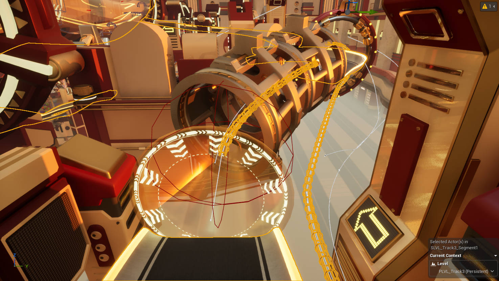
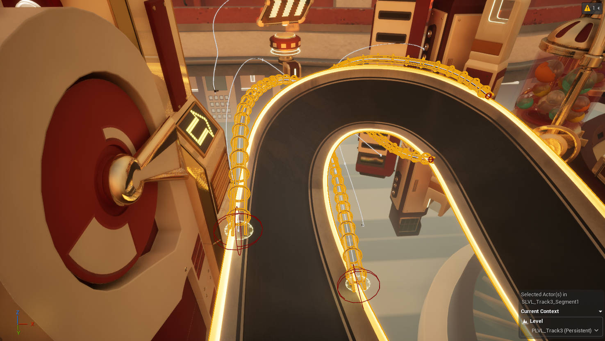
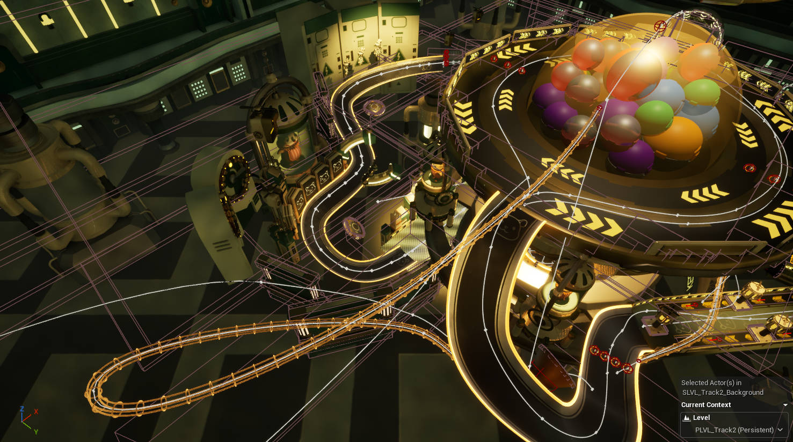
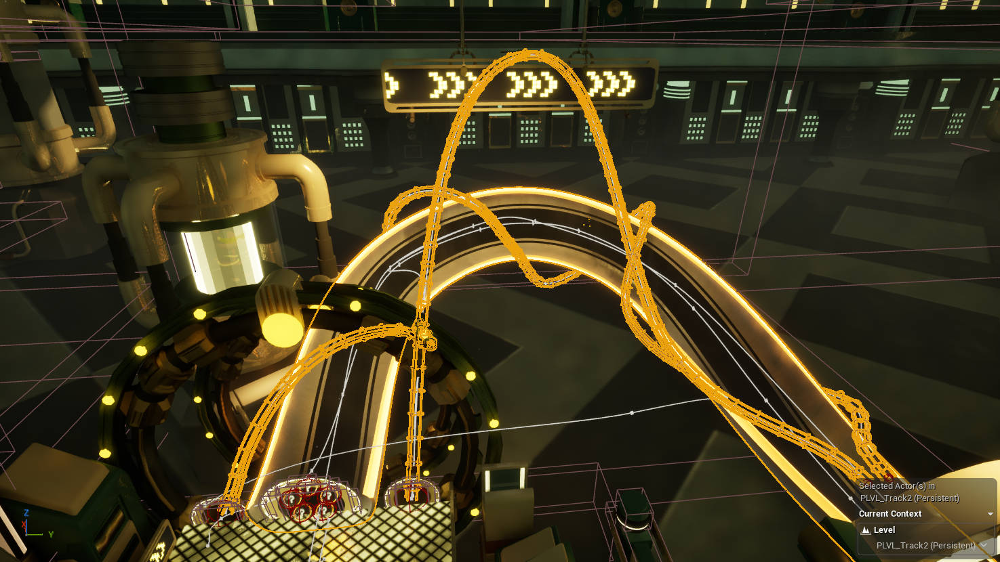

## Game Overview

Hamsterballin' is a local multiplayer racing game in which players control rolling and bouncing hamster balls across tracks filled with shortcuts, obstacles, and elevation changes. The project was created by SMU Guildhall Cohort 35 for Team Game Project II over a 12-week development cycle with a 42-person team.

@[youtube](HZVYPpXkfO8 "Hamsterballin' — Official Trailer")

## Final Track: Gacha Galaxy

As the primary level designer for the final track, I led its thematic concept, spatial layout, gameplay pacing, and implementation coordination. I worked continuously with artists, programmers, and other designers to keep track readability, racing rhythm, and visual presentation aligned throughout production.

## Cableway System and Camera Design

I designed and implemented the cableway system that runs throughout the track, including shortcut placement, interaction logic, and transitions back into the main route. During cableway travel, the camera showcases the environment, previews upcoming routes, and reinforces orientation. This allows the system to function simultaneously as a shortcut, a navigation tool, and a cinematic presentation device.

@[youtube](gYKeiV7x5rg "Cableway System and Camera Demonstration")

